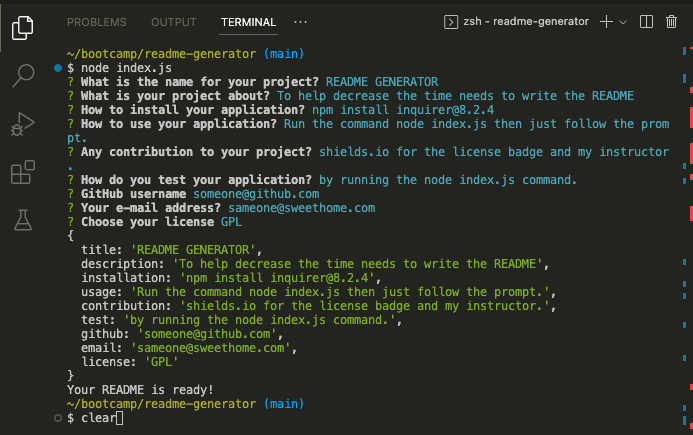
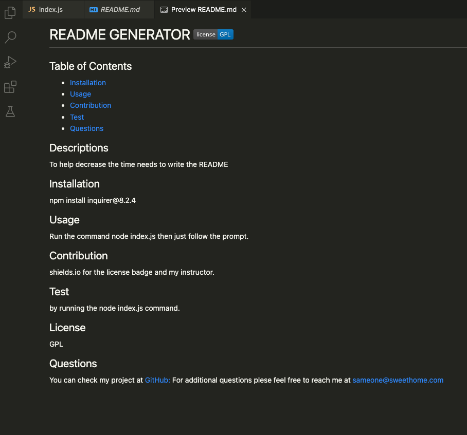

# Readme-Generator
Generate high quality README.md  

## Table of Contents
1. Desctiptions 
2. Visuals
3. Link to the walkthrough video

## Descriptions
README is a very important document in many work fields. It gives brief details of how the projects / apps work. High quality README will help users to have a better understanding about information that realated to the projects / appss i.e, how it works, how to use it, installation process, etc. 

For Developers, to be able to create README with less time will help them to focus on other tasks and able to get the workflow to continue with their productions.

## Visuals

```bash
 Command-line for the README GENERATOR app
```


```bash
README after being generated
```


## Link to the video


